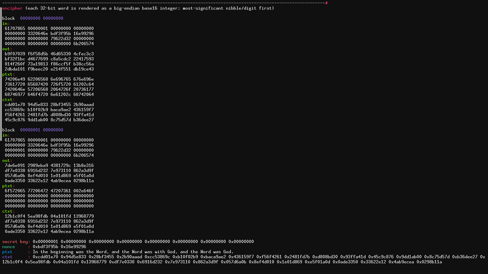
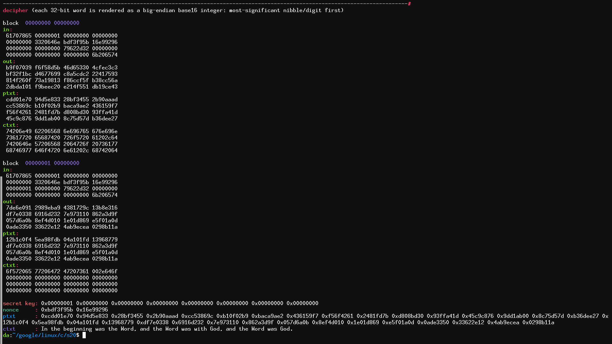

# Salsa20 C implementation




This is a **C** implementation of Bernstein's [Salsa20 stream cipher](https://cr.yp.to/snuffle.html).  
It is, in fact, multiple implementations, illustrating the different ways of viewing the algorithm.  

Also see [`mcipher`](https://github.com/etale-cohomology/mcipher), an expansion of Salsa20 from 256-bit keys and 512-bit blocks to 16384-bit keys and 32768-bit blocks.

# Introduction: the `salsa20(x)` block function

The following is an explanation of [Bernteins's page](https://cr.yp.to/salsa20.html).

The `salsa20(x)` block function is the "heart" of Salsa20.  

The basic building blocks of the `salsa20(x)` block function are `add`, `rotate-left`, and `xor`.  
These operation are chained in that order (`add-rotl-xor`, if you read it left-to-right) and applied to an entire column (or row) to produce something [Bernstein calls](https://cr.yp.to/snuffle/spec.pdf) the **quarterround**. (It's called the quarterround presumably because it acts of one-fourth of all the columns, or one-fourth of all the rows, of the 4x4 matrix; that is, it acts on 1 column or on 1 row.)  

The `salsa20(x)` block function maps 64 bytes to 64 bytes. (The chunk of 64 bytes is thought of as a "block").  
The 64-byte input x is taken as 16 little-endian 32-bit words `x0,x1,x2,x3,x4,x5,x6,x7,x8,x9,xa,xb,xc,xd,xe,xf` (which represent a `4x4` matrix whose entries are 32-bit words).  

```
x0 x1 x2 x3
x4 x5 x6 x7
x8 x9 xa xb
xc xd xe xf
```

To these 16 words you apply 320 invertible steps (`add-rotl-xor`), where each step (`add-rotl-xor`) changes 1 word.  
The resulting 16 32-bit words are added (mod `2**32`) word-wise to the original `x0,x1,x2,x3,x4,x5,x6,x7,x8,x9,xa,xb,xc,xd,xe,xf` words; this is the 64-byte output (in little-endian) of the `salsa20(x)` block function. (You will then `xor` this output with the plaintext, and that'll be the (encrypted) ciphertext.)  

Each `add-rotl-xor` involves xor'ing into one word a rotated version of the sum of 2 other words mod `2**32`. So the 320 steps (`add-rotl-xor`) are 320 adds, 320 xors, and 320 left-rotations. (The left-rotations are by constant distances.)  
So, in each step you take 3 words `a,b,c`, you compute the sum `a+b` (mod `2**32`), you compute the left-rotation `rotl(a+b)`, you compute the xor `c^rotl(a+b)`, and you set `c` as `c^rotl(a+b)`.  
1 round of the 20 rounds of Salsa20 consists of computing/updating `c = c^rotl(a+b)` for each word.  
Since `c^rotl(a+b)` is 3 operations (`add-rotl-xor`), and there are 16 words, and 20 rounds, that adds up to 320 (16 * 20) `add-rotl-xor`'s, or 960 (3 * 16 * 20) basic operations.  

The entire `salsa20(x)` block function is a sequences of 10 identical **doublerounds**.  
Each doubleround is 1 **columnround** followed by 1 **rowround**.  
Each columnround or rowround is a set of 4 parallel **quarterrounds**.  
Each **quarterround** modifies 4 words by computing `c = c^rotl(a+b)` for all words `c` in a given column or row.  

More specifically, if your input matrix to the `salsa20(x)` block function is

```
x0 x1 x2 x3
x4 x5 x6 x7
x8 x9 xa xb
xc xd xe xf
```

(recall this input matrix is just the secret key, the nonce, the counter, and the constants), then each of the 10 doublerounds you compute 

```
x4 = x4^rotl(xc,x0,  7);  x9 = x9^rotl(x1,x5,  7);  xe = xe^rotl(x6,xa,  7);  x3 = x3^rotl(xb,xf,  7);
x8 = x8^rotl(x0,x4,  9);  xd = xd^rotl(x5,x9,  9);  x2 = x2^rotl(xa,xe,  9);  x7 = x7^rotl(xf,x3,  9);
xc = xc^rotl(x4,x8, 13);  x1 = x1^rotl(x9,xd, 13);  x6 = x6^rotl(xe,x2, 13);  xb = xb^rotl(x3,x7, 13);
x0 = x0^rotl(x8,xc, 18);  x5 = x5^rotl(xd,x1, 18);  xa = xa^rotl(x2,x6, 18);  xf = xf^rotl(x7,xb, 18);

x1 = x1^rotl(x3,x0, 7);   x6 = x6^rotl(x4,x5,  7);  xb = xb^rotl(x9,xa,  7);  xc = xc^rotl(xe,xf,  7);
x2 = x2^rotl(x0,x1, 9);   x7 = x7^rotl(x5,x6,  9);  x8 = x8^rotl(xa,xb,  9);  xd = xd^rotl(xf,xc,  9);
x3 = x3^rotl(x1,x2, 13);  x4 = x4^rotl(x6,x7, 13);  x9 = x9^rotl(xb,x8, 13);  xe = xe^rotl(xc,xd, 13);
x0 = x0^rotl(x2,x3, 18);  x5 = x5^rotl(x7,x4, 18);  xa = xa^rotl(x8,x9, 18);  xf = xf^rotl(xd,xe, 18);
```

The entire 10 doublerounds of salsa20 is just 10 loops of that:

```
for(int i=0; i<10; ++i)
  x4 = x4^rotl(xc,x0,  7);  x9 = x9^rotl(x1,x5, 7);   xe = xe^rotl(x6,xa,  7);  x3 = x3^rotl(xb,xf,  7);
  x8 = x8^rotl(x0,x4,  9);  xd = xd^rotl(x5,x9, 9);   x2 = x2^rotl(xa,xe,  9);  x7 = x7^rotl(xf,x3,  9);
  xc = xc^rotl(x4,x8, 13);  x1 = x1^rotl(x9,xd, 13);  x6 = x6^rotl(xe,x2, 13);  xb = xb^rotl(x3,x7, 13);
  x0 = x0^rotl(x8,xc, 18);  x5 = x5^rotl(xd,x1, 18);  xa = xa^rotl(x2,x6, 18);  xf = xf^rotl(x7,xb, 18);

  x1 = x1^rotl(x3,x0, 7);   x6 = x6^rotl(x4,x5,  7);  xb = xb^rotl(x9,xa,  7);  xc = xc^rotl(xe,xf,  7);
  x2 = x2^rotl(x0,x1, 9);   x7 = x7^rotl(x5,x6,  9);  x8 = x8^rotl(xa,xb,  9);  xd = xd^rotl(xf,xc,  9);
  x3 = x3^rotl(x1,x2, 13);  x4 = x4^rotl(x6,x7, 13);  x9 = x9^rotl(xb,x8, 13);  xe = xe^rotl(xc,xd, 13);
  x0 = x0^rotl(x2,x3, 18);  x5 = x5^rotl(x7,x4, 18);  xa = xa^rotl(x8,x9, 18);  xf = xf^rotl(xd,xe, 18);
```

There is a nice geometric explanation/pattern to those calculations; they're not arbitrary.
Very roughly, the idea is that you start on the top-left corner (at `x0`), do the `add-rotl-xor`, then move to the next column and the next row (move 1 step to the right and 1 step down, to `x5`) and do the same, until you run out of columns/rows (that's 4 `add-rotl-xor`'s, 1 at `x0`, 1 at `x5`, 1 at `xa`, 1 at `xf`); then you go to the next row and walk in the same diagonal pattern 4 times, computing `add-rotl-xor`'s after each diagonal step, until you run out of rows (that's 4 rows); then you do the same but row-wise (or column-wise, depending on how you want to view it), and that's one doubleround.

# Mode of operation

If you want to encrypt, say, 128 bytes, then you encrypt 64 bytes at a time.  
Each time you encrypt 64 bytes, think of that as a **meta-round**.  
Each meta-round has 2 inputs and 2 outputs.  
Input 0 is a 64-byte 4x4 matrix of `u32` words containing the secret key, the nonce, the counter and the constants.  
Input 1 is a 64-byte 4x4 matrix containing 64 bytes of the plaintext.  
You pass input 0 to the `salsa20(x)` block function, and the result `salsa20(input0)` is 64 bytes of the **salsa byte stream** (where the full **salsa byte stream** is a `2**70`-byte sequence). `salsa20(input0)` is output 0.
Then you `xor` input 1 (the plaintext) and output 0 (`salsa20(input0)`), and the result is output 1.  
Output 1 is now 64 bytes of the ciphertext, and the meta-round is complete.  
Now increase the meta-round counter by 1.  
If there are more bytes left to encrypt, repeat the process; input 0 will be mostly the same, except the counter will have increased by 1.  

To decrypt the ciphertext, you repeat the exact same process, but you use the ciphertext is input 1, as opposed to the plaintext.  

Stuff like this is hard to explain and hard to read. Reading code is hard too. The best way is to read what you reasonably can and then implement the algorithm yourself, if you want to understand it.

This implementation (unlike Bernstein's) assumes a **little-endian** architectures: it happily casts `u8*` to `u32*` (and viceversa) without asking for permission.

# 4x4 matrix

This could come in handy when trying to understanding the algorithm.

Row-major indexing:

```
00 01 02 03
04 05 06 07
08 09 0a 0b
0c 0d 0e 0f
```

Col-major indexing:

```
00 04 08 0c
01 05 09 0d
02 06 0a 0e
03 07 0b 0f
```

# building

    gcc-8 s20.c -o s20  -Ofast  &&  ./s20

# References

https://cr.yp.to/snuffle.html  
https://cr.yp.to/salsa20.html  
https://cr.yp.to/snuffle/salsafamily-20071225.pdf  
https://cr.yp.to/snuffle/design.pdf  
https://cr.yp.to/snuffle/spec.pdf  
https://cr.yp.to/snuffle/speed.pdf  
https://cr.yp.to/snuffle/812.pdf  
